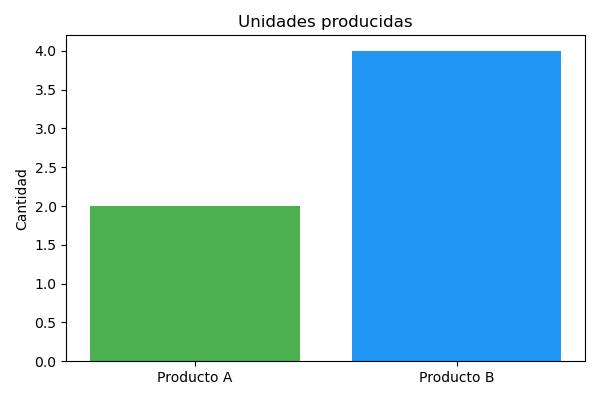
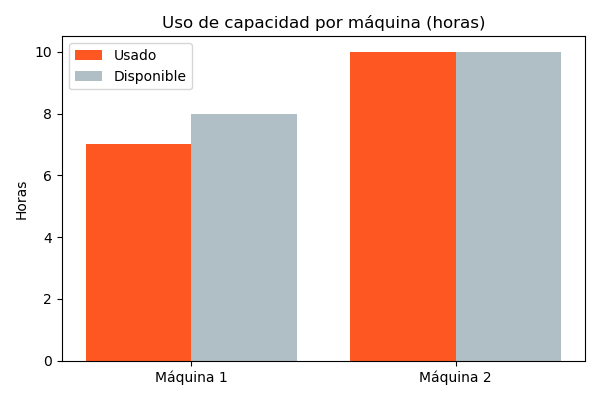

# Proyecto ProductionCapacityOptimizer
<p align="justify">
Este proyecto es una aplicación web desarrollada en Django que implementa un modelo de optimización enfocado en maximizar los ingresos diarios de una empresa manufacturera. El modelo considera restricciones de capacidad basadas en el tiempo disponible en dos máquinas de producción.
</p>

---

## Descripción del Modelo de Optimización
<p align="justify">
El modelo busca maximizar los ingresos diarios sujetos a las restricciones de tiempo disponible en dos máquinas de producción. Los parámetros de entrada incluyen precios de productos, tiempos de producción por máquina y horas disponibles para cada máquina. Los datos pueden ser cargados mediante un archivo CSV y modificados a través de campos opcionales en la interfaz web.
</p>

---

## Requisitos

- Python 3.10
- Django 5.2
- pandas
- matplotlib
- PuLP

Todas las dependencias necesarias están listadas en el archivo `requirements.txt`.

---

## Instalación

1. **Clonar el repositorio:**

   ```bash
   git clone https://github.com/catalinamurua/ProductionCapacityOptimizer.git
   cd ProductionCapacityOptimizer
    ```

2. **Crear y activar un entorno virtual (recomendado):**

   - **Linux / macOS:**

     ```bash
     python3 -m venv env
     source env/bin/activate
     ```

   - **Windows:**

     ```bash
     python -m venv env
     env\Scripts\activate
     ```

3. **Instalar las dependencias:**

    ```bash
      pip install -r requirements.txt
    ```


---
## Ejecución de la Aplicación

1. **Iniciar el servidor de desarrollo:**

   ```bash
   python manage.py runserver
   ```

2. **Abrir la aplicación en el navegador:**

    Ingresa a la siguiente URL en tu navegador:

    http://127.0.0.1:8000/

---

## Uso de la Aplicación

- En la página principal, sube un archivo CSV con los datos para la optimización.
- Opcionalmente, puedes modificar uno o varios parámetros del modelo mediante los campos opcionales en el formulario:
  - Horas disponibles máquina 1 y 2
  - Precio Producto A y B
  - Tiempos de producción para Producto A y B en ambas máquinas
  Si los parámetros ingresados son inconsistentes o generan restricciones irreales, se mostrará una advertencia.
- Presiona el botón **"Subir archivo"** para procesar los datos y ejecutar el modelo.
- La página de resultados mostrará:
  - Los parámetros usados en la optimización.
  - Los resultados optimizados (unidades producidas por producto e ingresos totales).
  - Gráficos con las unidades producidas y el uso de capacidad por máquina.
- Para realizar un nuevo cálculo con otros parámetros, haz clic en el botón **"Subir otro archivo"**.

---
## Ejemplos de Resultados

<p align="justify">
Una vez que el usuario carga correctamente el archivo CSV (o proporciona manualmente todos los parámetros requeridos), el modelo de optimización procesa los datos y muestra tanto los resultados numéricos como representaciones visuales. Estos resultados indican la cantidad óptima de unidades de cada producto que deben producirse para maximizar los ingresos, respetando las restricciones de capacidad de las máquinas.
</p>

A continuación se muestra un ejemplo de cómo podrían verse los resultados.

  #### Parámetros de entrada:

  | Parámetro                             | Valor |
  |--------------------------------------|-------|
  | Horas disponibles Máquina 1          | 8    |
  | Horas disponibles Máquina 2          | 10    |
  | Precio Producto A                    | 100    |
  | Precio Producto B                    | 80    |
  | Tiempo Producción A - Máquina 1      | 1.5   |
  | Tiempo Producción A - Máquina 2      | 2.0   |
  | Tiempo Producción B - Máquina 1      | 1.0   |
  | Tiempo Producción B - Máquina 2      | 1.5   |

  #### Resultados de la Optimización:

  - **Unidades de Producto A:** 2  
  - **Unidades de Producto B:** 4  
  - **Ingresos Totales:** \$520

  #### Visualizaciones:
<p float="left">
  
  
</p>

---
## Uso del script independiente (main.py)

Este proyecto incluye un script independiente, main.py, ubicado en la raíz del proyecto, que permite ejecutar el flujo completo de la optimización desde la consola, sin necesidad de levantar el servidor web. El script carga un archivo CSV de ejemplo llamado *example_data.csv*, ubicado también en la raíz principal del proyecto.

Para usarlo, ejecuta el script con:

   ```bash
   python main.py
   ```
Verás los resultados numéricos impresos en consola y se generarán los gráficos en la carpeta *output/.*

---
## Pruebas Unitarias

Para ejecutar las pruebas unitarias, usa:

  ```bash
  python manage.py test
  ```

---
## Inconvenientes y Consideraciones

- El archivo CSV debe tener el formato y columnas esperadas para que la carga y validación funcionen correctamente.

- Si no se carga ningún archivo CSV, el formulario mostrará un error solicitando subir un archivo.

- El modelo depende de que los datos sean coherentes para obtener resultados válidos.

---
## Contacto

Para dudas, sugerencias o contribuciones, puedes contactarme a través de **[catalina.muruua (at) gmail.com]**


